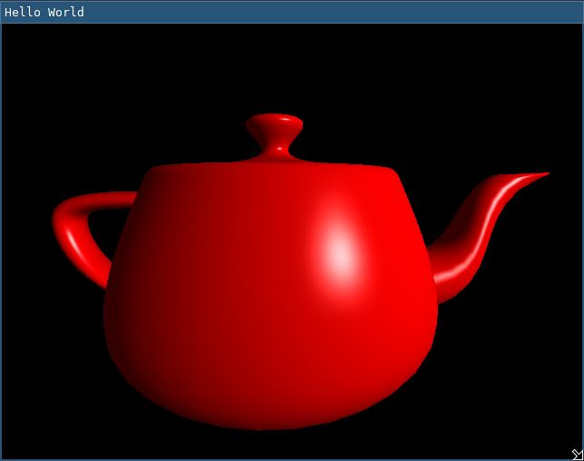

# Project 3 - Shading
CS 6610, Spring 2021, University of Utah

Bradley Walters, u1174994

18 February 2020

## What you implemented,
In my C codebase:
- I extended my .obj parser to parse vertex normals and faces.
- I implemented a naive algorithm to generate vertex and vertex normal buffers from .obj face data.
- I updated my renderer to draw triangle data (Step 1).
- I updated my renderer to send normals and other parameters to my shader program (Step 2).
- I implemented Blinn shading within my shader program (Step 3). (hopefully correct).
- I implemented mouse + keyboard controls to reposition the light (CS 6610 requirement).

This involved writing around 300 lines of code on top of project 2.

## What you could not implement,
N/A

## Additional functionalities beyond project requirements,
N/A

## How to use your implementation,
`make && ./main [file.obj]` after installing necessary dependencies.

- Left click and drag to adjust the camera angles.
- Right click and drag to adjust the camera distance.
- Hold control and left click and drag to adjust the light angles.
- Press F6 to recompile shaders.
- Press esc to exit the program.

## What operating system and compiler you used, and
I tested on x86_64 Linux 5.10 with gcc 10.2.0.

## External libraries and additional requirements to compile your project.
- SDL2
- GLEW
