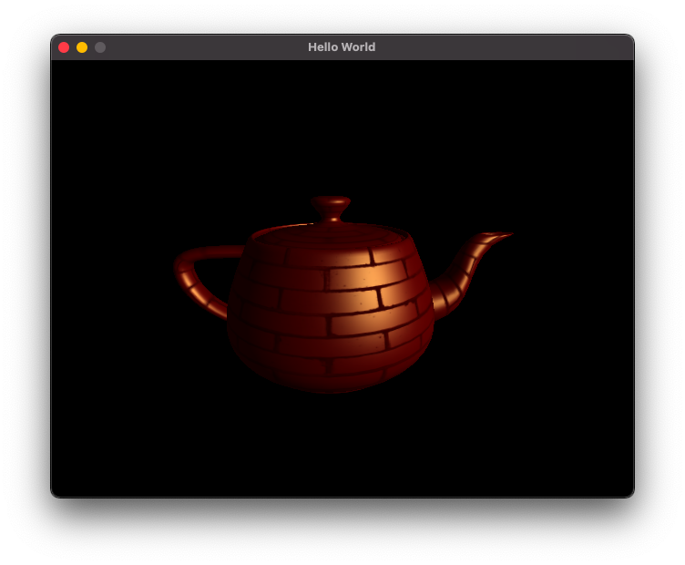

# Project 4 - Textures
CS 6610, Spring 2021, University of Utah

Bradley Walters, u1174994

22 February 2020

## What you implemented,
In my C codebase:
- I extended my .obj parser to parse `mtllib`, `usemtl`, and `vt` directives.
- I wrote an mtl parser to obtain colors and texture maps.
- I integrated SDL_image to load image files specified in material files.
- I updated my renderer to send texture coordinates to the shader program via a new VBO.
- I updated my renderer to send material parameters from the material file to the fragment shader.
- The renderer sends the ambient, diffuse, and specular colors and textures + the specular exponent to the shader program.

This involved writing around 400 lines of code on top of project 3.

## What you could not implement,
N/A

## Additional functionalities beyond project requirements,
In addition to sending the diffuse color and texture (required) and specular (required for CS 6610),
I also send the ambient color and texture as well as the specular exponent material parameters to the shader program.

## How to use your implementation,
`make && ./main [file.obj]` after installing necessary dependencies.

Note that `file.obj` must have all the aforementioned material parameters present.
Paths in the `obj` and `mtl` file(s) are assumed to be relative to the location of the `.obj` file.

- Left click and drag to adjust the camera angles.
- Right click and drag to adjust the camera distance.
- Hold control and left click and drag to adjust the light angles.
- Press esc to exit the program.

## What operating system and compiler you used, and
I tested on x86_64 macOS 11.2.1 with Apple clang version 12.0.0.

## External libraries and additional requirements to compile your project.
- pkg-config
- SDL2
- SDL2_image
- GLEW
