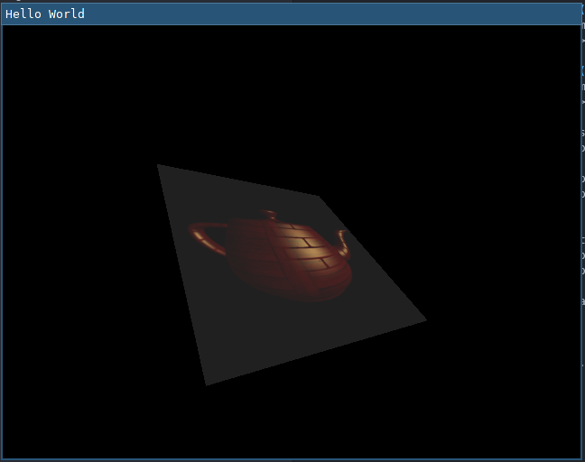

# Project 5 - Render to Texture
CS 6610, Spring 2021, University of Utah

Bradley Walters, u1174994

1 March 2021

## What you implemented,
In my C codebase:
- I implemented a second render pass to draw a texture rendered by the first.
- I refactored my renderer to reduce code duplication between two render passes.
- I displayed the rendered texture using mipmapping and anisotropic filtering.
- I added the requested mouse controls to adjust the scene parameters for the textured quad.

## What you could not implement,
N/A

## Additional functionalities beyond project requirements,
N/A

## How to use your implementation,
`make && ./main [file.obj]` after installing necessary dependencies.

Note that `file.obj` must have all the aforementioned material parameters present.
Paths in the `obj` and `mtl` file(s) are assumed to be relative to the location of the `.obj` file.

- Left click and drag to adjust the camera angles.
- Right click and drag to adjust the camera distance.
- Hold control and left click and drag to adjust the light angles.
- Hold alt and left click and drag to adjust the outer scene camera angles.
- Hold alt and right click and drag to adjust the outer scene camera distance.
- Press esc to exit the program.

## What operating system and compiler you used, and
I tested on x86_64 Linux 5.11.2 with gcc 10.2.0.

## External libraries and additional requirements to compile your project.
- pkg-config
- SDL2
- SDL2_image
- GLEW
